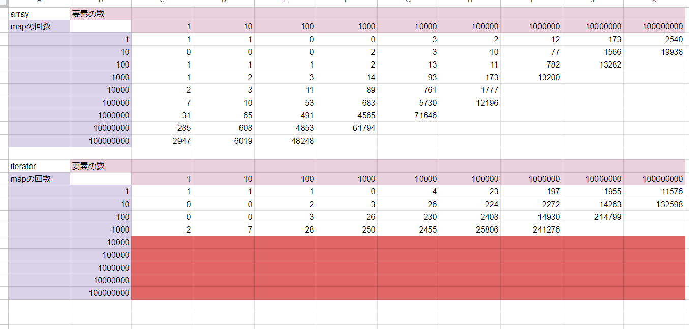
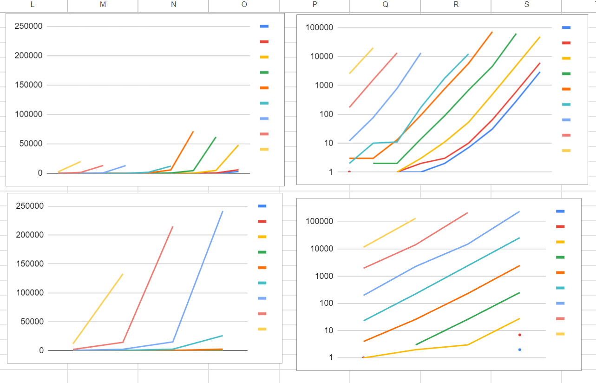
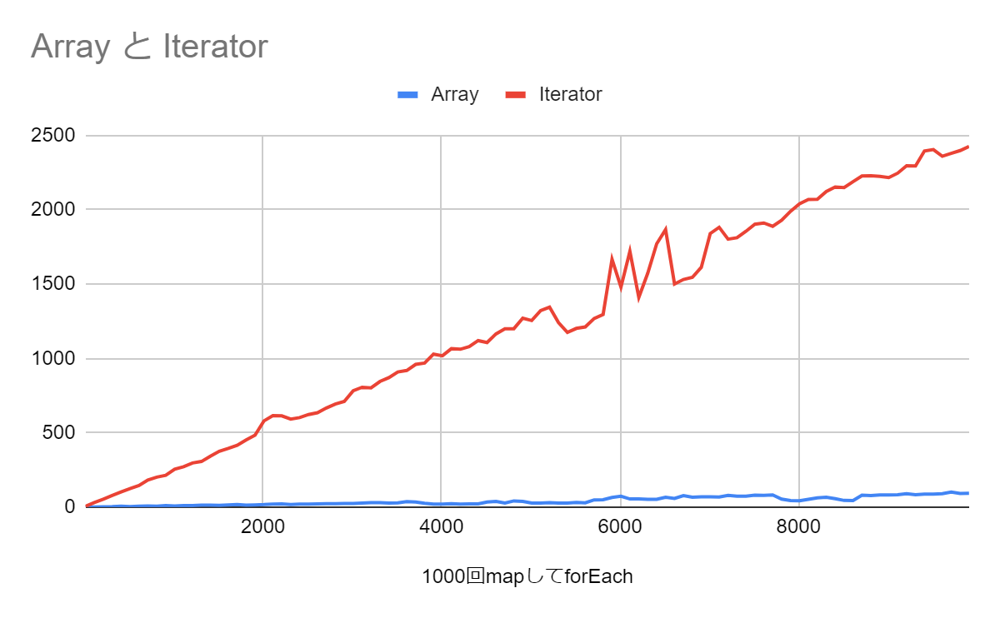
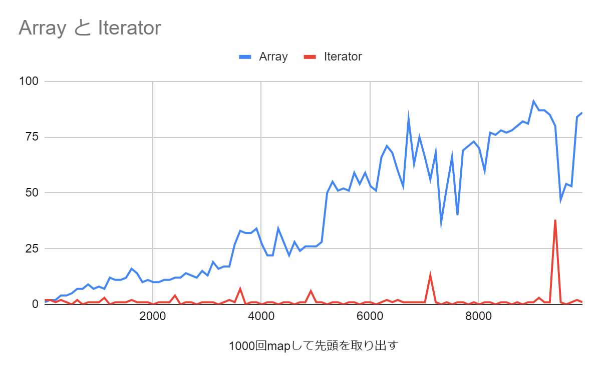
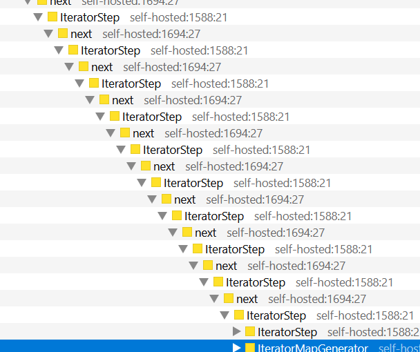

# IteratorHelpers使ってみた

39sho(さくしょー)

---

# 自己紹介
- 学年: 学部1年
- 名前: 作山 祥太
- 使う: JavaScript、TypeScript
- 好き: 激辛料理

---

# IteratorHelpersってなに？
- JavaScriptのIteratorを便利にするメソッドたち
- TC39 processのstage3
    - つまり仕様の策定はほぼ終わり、実装待ち
- firefoxのnightlyにフラグ付きで実装されてる！！
- ちなみにAsyncIteratorHelpersはstage2
    - こっちのほうが本命な気も...

---

# ちなみに(重要)
Iteratorにmapした関数は、Arrayと違い、
nextが呼び出されるまで実行されない

---

# 本題
使ってみた

---

# メモリ使用量(Array)
100万個の要素をもつArrayに1000回mapしたとき
%5B0%5D.png)

---

# メモリ使用量(Iterator)
100万個の要素をもつIteratorに1000回mapして、
nextを一回呼び出したとき
**少なすぎてグラフにできない！！**

---

1000個の要素をもつIteratorに1000回mapして、
forEach
.forEach(n%3Dn).png)

---

# やっぱり少ない
優秀

---

# 速度

---

---

- 最後にforEach
- 折れ線グラフが要素の数ごとにある
- 横軸がmapの回数、縦軸がかかった時間
- 上がArrayで、下がIterator
- 右のグラフは対数目盛

---

# おそい？
とは言っても、forEachじゃなくて先頭の要素だけなら

---

(1000回mapしたときの要素ごとの時間)

forEachですべての要素をとりだすとき

---

(1000回mapしたときの要素ごとの時間)

先頭の要素をとりだすとき

---

# おまけ
Iteratorの速度で、赤色に塗られてた範囲について

---

# 赤色に塗られていた範囲
- 先ほどのグラフには、mapの回数を増やした場合のデータが含まれてなかった
- 実はエラーになる 
- 再帰なんてしてないが！？

---

# 原因を探るために、spidermonkeyのソースコードを読みに行った

---

# 原因を探るために、core-jsのソースコードを読みに行った
polyfillでも同じ現象が起きてた

---

# 原因を探るために、proposalを読みに行った
spidermonkeyでもcore-jsでも同じなら、実装の問題ではないのでは？という発想

---

# わからん
nextを呼んだときに、一番最初のイテレータまでコールスタックに積みながらさかのぼっていくぽい

---

# おわり

